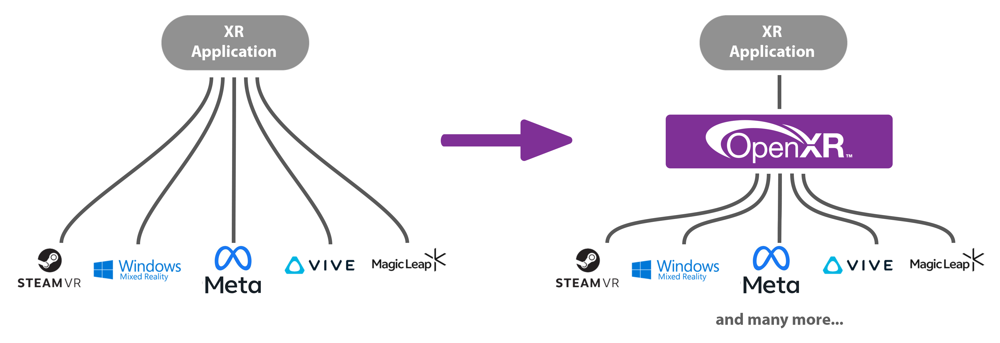
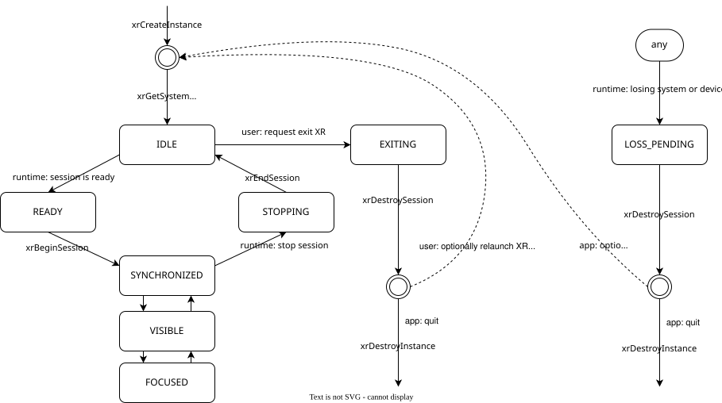

Are you looking to implement VR support into your C++ application or game engine? If so, you'll quickly land on OpenXR - the open, cross-platform standard for VR and AR that allows you to target Meta, SteamVR and more from a single codebase.

Getting started with this is quite challenging however. When I started my project at Breda University of Applied Sciences I encountered this firsthand - since few people actually implement this from scratch, practical tutorials are few and far between and you'll often find yourself relying on the dense OpenXR specification instead. The API also requires wiring up a lot of moving parts before anything renders which can make it challenging to see if everything is working correctly.

This article covers that process: what OpenXR actually requires, how the pieces fit together, and how I wrapped it into a library called OXR that makes the whole thing easier to drop into your own project.

---

## End result
By the end you should have a clear picture of what it takes to get a headset rendering frames and polling input from your own C++ code.

These are some of the games and demos created using OXR.


Ascension Protocol, my second year project, was also made using OXR and the starting point below.  
You can read more about that project [here](/projects/ascension-protocol){:target="_blank"}.
<iframe width="560" height="315" src="https://www.youtube-nocookie.com/embed/pc8jxNV2bAw?si=n5Rs2VC2kQDlqNKp" title="YouTube video player" frameborder="0" allow="accelerometer; autoplay; clipboard-write; encrypted-media; gyroscope; picture-in-picture; web-share" referrerpolicy="strict-origin-when-cross-origin" allowfullscreen></iframe>

## Why OpenXR?
First I wanted to briefly cover the decision to use OpenXR, as this is not as self-explanatory for someone who hasn't used it before.

Before the times of OpenXR, the VR landscape was fragmented. If you wanted to support SteamVR devices, you had to interface with Valve's OpenVR API, if you wanted to support Oculus/Meta devices they again had their own LibOVR API, and so on. This meant you either had to put up a lot of extra work in front, or reach a smaller target audience.

Different companies in the VR market banded together to create OpenXR - a single, unified cross-platform API that can reach all platforms while being extendable enough to take advantage of each platform's unique features.



## Foreword & resources
My code builds upon the learnings and foundations provided by the [OpenXR Tutorial website](https://openxr-tutorial.com/){:target="_blank"}. While it can be a bit of a deep dive and the architecture a bit complex to work around, it provides a great starting point and reference.

I also highly recommend reading through [the OpenXR Specification](https://registry.khronos.org/OpenXR/specs/1.0/html/xrspec.html){:target="_blank"}. for specific details. Even though it can be quite technical and hard to get through it does provide a full and definitive explanation for everything you'll need to build an OpenXR application.

This article covers my process implementing VR support into the BEE engine made at BUas for Windows and OpenGL. While I can't share the full source of this, most steps in the process should be engine agnostic or easy to adapt.

## Implementing OpenXR into your application from scratch
### Initialization
#### Creating an instance
The XrInstance is your connection to the OpenXR runtime. You'll need to specify some information about your application to the runtime including a name and version.

You also need to specify which version of the OpenXR API you want to load. The latest version at time of writing is 1.1.60, but keep in mind that most runtimes still do not support 1.1 and will fail to launch.

```c++
// Give the runtime some information about your application
XrApplicationInfo AI;
strncpy_s(AI.applicationName, "My OpenXR App", XR_MAX_APPLICATION_NAME_SIZE);
AI.applicationVersion = sessionInfo.app.applicationVersion;
AI.apiVersion = XR_CURRENT_API_VERSION;
```

You also specify which extensions and API layers to enable. These provide additional functionality beyond the core specification. At minimum you need the graphics extension for your backend (e.g. `XR_KHR_OPENGL_ENABLE_EXTENSION_NAME`).

Before passing them to the instance, it's good practice to enumerate what the runtime actually supports and filter your request down to what's available - requesting an unsupported extension causes xrCreateInstance to fail. This also introduces a pattern you'll see throughout the OpenXR API: call once to get the count & resize your buffer, then call again to fill it:

```c++
uint32_t extensionCount = 0;
xrEnumerateInstanceExtensionProperties(nullptr, 0, &extensionCount, nullptr);

std::vector<XrExtensionProperties> extensionProperties(extensionCount, {XR_TYPE_EXTENSION_PROPERTIES});
xrEnumerateInstanceExtensionProperties(nullptr, extensionCount, &extensionCount, extensionProperties.data());
```

Filter your requested extensions against this list, then create the instance with whatever was found:

```c++
XrInstanceCreateInfo instanceCI{ XR_TYPE_INSTANCE_CREATE_INFO };
XrInstance xrInstance;

instanceCI.applicationInfo         = AI;
instanceCI.enabledExtensionCount   = static_cast<uint32_t>(activeExtensions.size());
instanceCI.enabledExtensionNames   = activeExtensions.data();
xrCreateInstance(&instanceCI, &xrInstance);
```

Before going further, it's worth enabling XR_EXT_debug_utils as an extension and setting up a debug messenger. This gives you validation messages from the runtime when something goes wrong, which saves a lot of time debugging silent failures later.

#### System
The `XrSystemId` identifies the physical hardware (the headset). It's not a handle you create, but instead you request it from the runtime.
You need to specify the form factor of the device (e.g. HMD vs mobile phone), but for our purposes this will always be an `XR_FORM_FACTOR_HEAD_MOUNTED_DISPLAY`:
```cpp
XrSystemGetInfo systemGI{ XR_TYPE_SYSTEM_GET_INFO };
systemGI.formFactor = XR_FORM_FACTOR_HEAD_MOUNTED_DISPLAY;
xrGetSystem(xrInstance, &systemGI, &systemId);
```

If no headset is connected, this call fails. This is your first real indication that the runtime can see your hardware!

#### Session
The XrSession is the core object most of your application will interact with. It represents the currently active connection between your application and the HMD.

Before creating the session you are required to call the graphics requirements check for your graphics extension (e.g. xrGetOpenGLGraphicsRequirementsKHR). This verifies your graphics driver meets the runtime's minimum requirements. Skipping it will cause session creation to fail.

```c++
// The function isn't part of the core spec, so you need to load it manually
PFN_xrGetOpenGLGraphicsRequirementsKHR xrGetOpenGLGraphicsRequirementsKHR = nullptr;
xrGetInstanceProcAddr(xrInstance, "xrGetOpenGLGraphicsRequirementsKHR",
    (PFN_xrVoidFunction*)&xrGetOpenGLGraphicsRequirementsKHR);

XrGraphicsRequirementsOpenGLKHR requirements{ XR_TYPE_GRAPHICS_REQUIREMENTS_OPENGL_KHR };
xrGetOpenGLGraphicsRequirementsKHR(xrInstance, systemId, &requirements);
```

Creating it requires giving it a binding to your graphics context. You hand OpenXR a struct containing your platform-specific handles (on Win32 + OpenGL, that's your `HDC` and `HGLRC`):

```cpp
XrGraphicsBindingOpenGLWin32KHR graphicsBinding{ XR_TYPE_GRAPHICS_BINDING_OPENGL_WIN32_KHR };
graphicsBinding.hDC   = wglGetCurrentDC();
graphicsBinding.hGLRC = wglGetCurrentContext();

XrSessionCreateInfo sessionCI{ XR_TYPE_SESSION_CREATE_INFO };
sessionCI.next     = &graphicsBinding;
sessionCI.systemId = systemId;
xrCreateSession(xrInstance, &sessionCI, &session);
```

#### The Session State Machine
Once created, your session moves through a set of states that you must respond to via the event system. The basic flow looks like this:



- You move from IDLE to READY when the runtime is ready to begin - you must respond by calling xrBeginSession.
- The session becomes FOCUSED when the user is actively in your application.
- STOPPING means you should call xrEndSession.

Missing these transitions will cause the runtime to behave incorrectly or crash.

Events are polled via `xrPollEvent` each frame:

```cpp
XrEventDataBuffer eventData{ XR_TYPE_EVENT_DATA_BUFFER };
while (xrPollEvent(xrInstance, &eventData) == XR_SUCCESS)
{
    switch (eventData.type)
    {
        case XR_TYPE_EVENT_DATA_SESSION_STATE_CHANGED:
        {
            auto* stateChanged = reinterpret_cast<XrEventDataSessionStateChanged*>(&eventData);
            switch (stateChanged->state)
            {
                case XR_SESSION_STATE_READY:
                    xrBeginSession(session, &sessionBeginInfo);
                    break;
                case XR_SESSION_STATE_STOPPING:
                    xrEndSession(session);
                    break;
                case XR_SESSION_STATE_LOSS_PENDING:
                    // headset disconnected - attempt to recreate session
                    break;
            }
        }
    }
}
```
`XR_SESSION_STATE_LOSS_PENDING` is worth handling - it fires when the headset is disconnected, goes to sleep, or otherwise causes the session to become invalid. A robust application will tear down the session objects and periodically attempt to recreate them until the hardware comes back.

#### Reference Spaces
OpenXR uses spaces to represent coordinate frames. Later in this article we will need this to get the pose of the HMD and controllers in the world.

The most useful one for games is `XR_REFERENCE_SPACE_TYPE_STAGE`, which has its origin at the center of the physical play area at floor level:

```cpp
XrReferenceSpaceCreateInfo spaceCI{ XR_TYPE_REFERENCE_SPACE_CREATE_INFO };
spaceCI.referenceSpaceType   = XR_REFERENCE_SPACE_TYPE_STAGE;
spaceCI.poseInReferenceSpace = { {0,0,0,1}, {0,0,0} }; // identity pose, no offset
xrCreateReferenceSpace(session, &spaceCI, &localSpace);
```

### Swapchains & Rendering
We now have our connection to the headset, but without graphics this doesn't do much of course. It is important to keep in mind that while OpenXR is tightly linked to your graphics, it does not provide a renderer itself.

#### View Configurations
HMDs vary a lot in how they're physically set up - a standard stereo headset has two displays, one per eye, but other form factors exist (mono displays, or even quad displays). OpenXR abstracts this with view configurations, which describe the display arrangement of the system.

We can query which types this headset supports, but for now we will assume `XR_VIEW_CONFIGURATION_TYPE_PRIMARY_STEREO` - two views, one per eye.

We pass this to the instance and query information about these views, including the panel resolution, which we will use for rendering later.

```c++
XrViewConfigurationType selectedViewConfigType = XR_VIEW_CONFIGURATION_TYPE_PRIMARY_STEREO;

uint32_t viewCount = 0;
xrEnumerateViewConfigurationViews(xrInstance, systemId, selectedViewConfigType, 0, &viewCount, nullptr);

std::vector<XrViewConfigurationView> viewConfigViews(viewCount, {XR_TYPE_VIEW_CONFIGURATION_VIEW});
xrEnumerateViewConfigurationViews(xrInstance, systemId, selectedViewConfigType,
                                  viewCount, &viewCount, viewConfigViews.data());

// Use the recommended resolution for swapchains & rendering
uint32_t imageWidth  = viewConfigViews[0].recommendedImageRectWidth;
uint32_t imageHeight = viewConfigViews[0].recommendedImageRectHeight;
```

#### Swapchains
A swapchain is a pool of images managed by the OpenXR runtime that your application renders into. Rather than allocating your own render targets, you request an image from the runtime to render into.

Instead of having one buffer per eye, the swapchain is typically double or triple buffered. This allows the compositor to always have a completed frame available to display, even while your application is rendering the next one — preventing blackouts or tearing on the headset display.

You create one swapchain per view (i.e. per eye). We need to pass it some info, including the resolution from before, sample count and a color format that the buffer will be stored in:

```cpp
XrSwapchainCreateInfo swapchainCI{ XR_TYPE_SWAPCHAIN_CREATE_INFO };
swapchainCI.usageFlags  = XR_SWAPCHAIN_USAGE_COLOR_ATTACHMENT_BIT;
swapchainCI.format      = selectedColorFormat; // GL_SRGB8_ALPHA8
swapchainCI.width       = viewConfigViews[i].recommendedImageRectWidth;
swapchainCI.height      = viewConfigViews[i].recommendedImageRectHeight;
swapchainCI.sampleCount = viewConfigViews[i].recommendedSwapchainSampleCount;
swapchainCI.faceCount   = 1;
swapchainCI.arraySize   = 1;
swapchainCI.mipCount    = 1;
xrCreateSwapchain(session, &swapchainCI, &swapchain);
```

The color format you choose is actually pretty important - initially I just put a `GL_RGBA8`, but this made the colors look washed out.
Usually an SRGB format like `GL_SRGB8_ALPHA8` works well, but it is worth querying the runtime for all the supported/preferred types using `xrEnumerateSwapchainFormats`.

**Note on depth buffers:**  
Ideally you would also like to create depth swapchains, which will provide the runtime with more information to e.g. reproject the images if necessary. For now we will only focus on color as this is all you need to get started rendering. 

#### Image views
After creating the swapchain the runtime then creates the actual texture objects. You enumerate them after creation and create image views into them, just like you would with any framebuffer texture.

```c++
// Enumerate swapchain images
uint32_t colorImageCount = 0;
xrEnumerateSwapchainImages(swapchain, 0, &colorImageCount, nullptr);

// XrSwapchainImageOpenGLKHR wraps a GLuint texture
std::vector<XrSwapchainImageOpenGLKHR> swapchainImages(colorImageCount, {XR_TYPE_SWAPCHAIN_IMAGE_OPENGL_KHR});
xrEnumerateSwapchainImages(swapchain, colorImageCount, &colorImageCount, reinterpret_cast<XrSwapchainImageBaseHeader*>(swapchainImages.data()));

// Create a framebuffer per image
std::vector<GLuint> framebuffers(colorImageCount);
for (uint32_t i = 0; i < colorImageCount; i++)
{
    glGenFramebuffers(1, &framebuffers[i]);
    glBindFramebuffer(GL_FRAMEBUFFER, framebuffers[i]);
    glFramebufferTexture2D(GL_FRAMEBUFFER, GL_COLOR_ATTACHMENT0,
                           GL_TEXTURE_2D, swapchainImages[i].image, 0);
}
```

#### Per-frame rendering
Now that we have the swapchains to render into we can start rendering!

Each frame follows the same acquire → render → release pattern per eye:

```cpp
// Synchronize to the runtime refresh rate & get timing info
xrWaitFrame(session, &frameWaitInfo, &frameState);
xrBeginFrame(session, &frameBeginInfo);

// Locate views (get per-eye pose and FOV for this frame's predicted display time)
XrViewLocateInfo viewLocateInfo{XR_TYPE_VIEW_LOCATE_INFO};
viewLocateInfo.viewConfigurationType = selectedViewConfigType;
viewLocateInfo.displayTime = frameState.predictedDisplayTime;
viewLocateInfo.space = localSpace;
xrLocateViews(session, &viewLocateInfo, &viewState, viewCount, &viewCount, views.data());

for (uint32_t i = 0; i < viewCount; i++)
{
    // Acquire an image from the swapchain
    xrAcquireSwapchainImage(swapchain[i], &acquireInfo, &imageIndex);
    xrWaitSwapchainImage(swapchain[i], &waitInfo);

    // Render into swapchainImages[imageIndex] using views[i].pose and views[i].fov
    // ...

    xrReleaseSwapchainImage(swapchain[i], &releaseInfo);
}

// Submit the frame to the compositor
xrEndFrame(session, &frameEndInfo); // includes your projection layer
```

`xrLocateViews` is what gives you the per-eye camera transforms at the predicted display time. Using the predicted time rather than the current time is what keeps the rendered image aligned with head movement.

**A note on FOV:**  
One issue I ran into when I first started rendering was that the field of view is not symmetric like in a typical game camera. In a standard renderer you usually define FOV as a single angle and build a symmetric projection matrix from it. In VR, each eye's display is usually offset from the optical center of the lens, so the frustum is asymmetric.

OpenXR provides a helper function for this in its math utilities:

```cpp
// XrFovf from xrLocateViews per eye
struct XrFovf {
    float angleLeft; 
    float angleRight;
    float angleUp;   
    float angleDown; 
};

XrMatrix4x4f projection;
XrMatrix4x4f_CreateProjectionFov(&projection, view.fov, nearZ, farZ);
```

You should now be able to have all the data to draw a scene from the HMD's perspective, and draw it into the swapchains!

### Actions & Input
We can now render a nice scene, but a VR game isn't much without user interaction. This is another aspect that shows how OpenXR is made to interface with all sorts of hardware.

Rather than polling raw button states directly, you define semantic actions that describe what your application needs - "grab", "teleport", "shoot" - and then suggest bindings that map those actions to specific hardware paths. The runtime handles remapping, and your code works across different controller layouts without changes.

#### Defining actions
Actions are grouped into action sets (e.g. "gameplay", "ui", "driving", etc.). You create a set, then create individual actions within it:

```cpp
// Create action set
XrActionSet actionSetGameplay;
XrActionSetCreateInfo actionSetCI{ XR_TYPE_ACTION_SET_CREATE_INFO };
strncpy(actionSetCI.actionSetName, "gameplay", XR_MAX_ACTION_SET_NAME_SIZE);
strncpy(actionSetCI.localizedActionSetName, "Gameplay", XR_MAX_LOCALIZED_ACTION_SET_NAME_SIZE);
xrCreateActionSet(xrInstance, &actionSetCI, &actionSetGameplay);

// Create an action for the grab trigger (analog float, both hands)
XrPath handPaths[2];
xrStringToPath(xrInstance, "/user/hand/left",  &handPaths[0]);
xrStringToPath(xrInstance, "/user/hand/right", &handPaths[1]);

XrActionCreateInfo actionCI{ XR_TYPE_ACTION_CREATE_INFO };
actionCI.actionType          = XR_ACTION_TYPE_FLOAT_INPUT;
actionCI.countSubactionPaths = 2;
actionCI.subactionPaths      = handPaths;
strncpy(actionCI.actionName, "grab", XR_MAX_ACTION_NAME_SIZE);
xrCreateAction(actionSetGameplay, &actionCI, &grabAction);
```

The subaction path (/user/hand/left, /user/hand/right) lets a single action represent the same input on both hands, with results queryable per-hand.

#### Suggesting bindings
We will of course still need some connection to the actual controller inputs - the runtime won't be able to guess what you want 'grab' to be triggered by.

We can set these bindings for a default 'simple controller' provided by OpenXR, or for specific vendors, such as the oculus touch controller:

```cpp
XrPath bindingPath;
xrStringToPath(xrInstance, "/user/hand/left/input/squeeze/value", &bindingPath);

XrActionSuggestedBinding binding{ grabAction, bindingPath };

XrInteractionProfileSuggestedBinding profileBindings{ XR_TYPE_INTERACTION_PROFILE_SUGGESTED_BINDING };
xrStringToPath(xrInstance, "/interaction_profiles/oculus/touch_controller", &profileBindings.interactionProfile);
profileBindings.suggestedBindings       = &binding;
profileBindings.countSuggestedBindings  = 1;
xrSuggestInteractionProfileBindings(xrInstance, &profileBindings);
```

You can suggest bindings for multiple profiles (Oculus Touch, Valve Index, etc.) and the runtime will use whichever matches the connected hardware. Even if you don't provide bindings for a specific vendor, the runtime will usually try to remap the ones you provided! This makes it very easy to support a wide range of devices.

#### Polling actions per frame
Before we can start querying the input, we must first attach it to the session:
```c++
std::vector<XrActionSet> allActionSets { actionSetGameplay };

XrSessionActionSetsAttachInfo actionSetAttachInfo{XR_TYPE_SESSION_ACTION_SETS_ATTACH_INFO};
actionSetAttachInfo.countActionSets = static_cast<uint32_t>(allActionSets.size());
actionSetAttachInfo.actionSets = allActionSets.data();
xrAttachSessionActionSets(m_session, &actionSetAttachInfo);
```

Each frame we can then sync the active sets and query per-action state:

```cpp
// Sync
XrActiveActionSet activeSet{ actionSet, XR_NULL_PATH };
XrActionsSyncInfo syncInfo{ XR_TYPE_ACTIONS_SYNC_INFO };
syncInfo.countActiveActionSets = 1;
syncInfo.activeActionSets      = &activeSet;
xrSyncActions(session, &syncInfo);

// Query
XrActionStateGetInfo getInfo{ XR_TYPE_ACTION_STATE_GET_INFO };
getInfo.action        = grabAction;
getInfo.subactionPath = handPaths[0]; // left hand

XrActionStateFloat state{ XR_TYPE_ACTION_STATE_FLOAT };
xrGetActionStateFloat(session, &getInfo, &state);

if (state.isActive && state.currentState > 0.5f)
    // handle grab
```

---

## OXR - An easier approach?
That covers just about everything you would need to make an OpenXR application with C++ and OpenGL. As you can see, the individual steps are reasonable once understood, but require a lot of setup and some time to understand the full pipeline.

This is where OXR comes in - the wrapper library I created over the course of 8 weeks and subsequent iterations at Breda University of Applied Sciences. This covers all of the boilerplate setup in the section above so you can focus on creating your VR application, instead of writing tedious OpenXR calls.

### Platform abstraction
Inspired by the OpenXR-Tutorial's GraphicsAPI and Dear ImGui's graphics backends, I implemented an `IGraphicsBackend` interface into the project which abstracts all platform-specific code away. Simply download the right backend and include it in your project!

### Basic usage
**Integration:** OXR is designed to be easy to drop into your project:
1. Add `oxr/oxr.hpp` and `oxr/oxr.cpp` to your project.
2. Link against the OpenXR loader library (`openxr_loader.lib`) and add the OpenXR headers to your include path.
3. Download and include the graphics backend for your target platform.

**Setup:** Define input actions & initialize the session.
```c++
#include <oxr/oxr.hpp>

// Create the session object
oxr::Session session;

// Define your input actions
oxr::ActionSetCreateInfo actions = {
    "openxr-demo-gameplay",
    "OpenXR Demo Gameplay",
    0,
    true,
    {
        {"palm-pose", "Palm Pose", oxr::ActionType::Pose, {oxr::SubactionPath::LEFT_HAND, oxr::SubactionPath::RIGHT_HAND}},
        {"buzz", "Buzz", oxr::ActionType::Vibration, {oxr::SubactionPath::LEFT_HAND, oxr::SubactionPath::RIGHT_HAND}},
        {"grab", "Grab", oxr::ActionType::Float, {oxr::SubactionPath::LEFT_HAND, oxr::SubactionPath::RIGHT_HAND}},
    },
};

// Define the action bindings
oxr::InteractionProfileBindings bindings = {
    "/interaction_profiles/oculus/touch_controller",
    {
        {"palm-pose", "/user/hand/left/input/aim/pose"},
        {"palm-pose", "/user/hand/right/input/aim/pose"},
        {"buzz", "/user/hand/left/output/haptic"},
        {"buzz", "/user/hand/right/output/haptic"},
        {"grab", "/user/hand/left/input/squeeze/value"},
        {"grab", "/user/hand/right/input/squeeze/value"},
    },
};

// Configure application info
oxr::SessionCreateInfo config;
config.app
	.SetApplicationName("OpenXR Demo")
	.SetApplicationVersion(1)
	.SetEngineName("Bee Engine")
	.SetEngineVersion(1);

config.actions
    .AddActionSet(actions)
    .AddBinding(bindings);

// Initialize - creates swapchains, input bindings, etc.
session.Init(config);
```

**Update:** Poll input actions and render to the headset.
```c++
oxr.Update(); // Poll system events, handle reconnection

if (oxr.BeginFrame()) // Prepare for rendering, get timing info
{
    oxr.PollActions(); // Poll input actions

    for (size_t i = 0; i < oxr.GetViewsCount(); ++i) // Amount of displays in the headset
    {
        // Update in-game camera with OpenXR information per eye
        camera.SetTranslation(XrVector3f_To_glm_vec3(oxr.GetCameraTranslation(i)));
        camera.SetRotation(XrQuaternionf_To_glm_quat(oxr.GetCameraOrientation(i)));
        camera.SetProjection(XrMatrix4x4f_To_glm_mat4x4(oxr.GetCameraProjectionMatrix(i, NEAR_PLANE, FAR_PLANE)));

        oxr::SwapchainImage swapchainImage = oxr.AcquireSwapchainImage(i);

        // Your custom rendering logic - write into the swapchain image
        renderer->Render(dt);

        // Blit to the framebuffer
        glBindFramebuffer(GL_READ_FRAMEBUFFER, renderer->GetFinalFrameBuffer());
        glBindFramebuffer(GL_DRAW_FRAMEBUFFER, (GLuint)(uint64_t)swapchainImage.image);
        glReadBuffer(GL_COLOR_ATTACHMENT0);
        glDrawBuffer(GL_COLOR_ATTACHMENT0);
        glBlitFramebuffer(0,
                        0,
                        swapchainImage.width,
                        swapchainImage.height,
                        0,
                        0,
                        swapchainImage.width,
                        swapchainImage.height,
                        GL_COLOR_BUFFER_BIT,
                        GL_NEAREST);

        glBindFramebuffer(GL_FRAMEBUFFER, 0);

        oxr.ReleaseSwapchainImage(i);
    }

    oxr.EndRender();
}

oxr.EndFrame();
```

**Poll actions:** Get the state of your previously defined input actions, or set haptics on the controllers.

```c++
// Get input action state
auto actionStatePose = oxr.GetActionState<oxr::ActionStatePose>("palm-pose", oxr::SubactionPath::LEFT_HAND);
if (actionStatePose)
{
    const auto& currentState = actionStatePose->currentState;
    leftHand.SetTranslation(XrVector3f_To_glm_vec3(currentState.position));
    leftHand.SetRotation(XrQuaternionf_To_glm_quat(currentState.orientation));
}

...

// Set a haptic vibration on the controller
OXR::Vibration vibration;
vibration.amplitude = 10.f;
vibration.duration = 100000000;
Engine.XR().SetHapticOutput("buzz", static_cast<OXR::SubactionPath>(ControllerIndex::RIGHT_CONTROLLER_INDEX), vibration);
```

## Conclusion
Working with OpenXR has been challenging and rewarding. The API is well-designed to allow interactions with all XR devices, but the learning curve is steep. A lot of time was spent reading through the OpenXR specification, cross-referencing with the OpenXR Tutorial, and debugging issues that better documentation or more practical examples would have made obvious much sooner.

If you're starting your own OpenXR project, I hope this article gave you a clearer picture of what's involved. The OpenXR Tutorial and specification are still the best places to go deeper, but hopefully now you will have a little more context.

My wrapper library OXR provides an easy way to skip past the boilerplate required to set up an OpenXR application. However, in the fututure it can still use some work:

- **Additional graphics backends:** While I only had time to implement the Win32 + OpenGL backend, the IGraphicsBackend interface was designed to support many more. A Vulkan/D3D/Linux backend would help make the library a useful alternative for more applications
- **CMake integration**: making OXR easier to pull into a project as a proper dependency rather than dropping in files manually
- **Depth swapchain support**: enabling the runtime to use depth information for reprojection, which improves perceived latency
- **More flexibility for power users**: exposing more of the underlying OpenXR configuration for projects that need finer control than the defaults provide