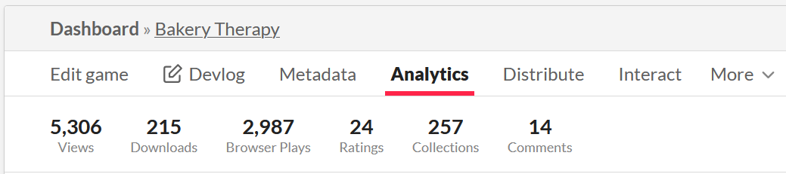
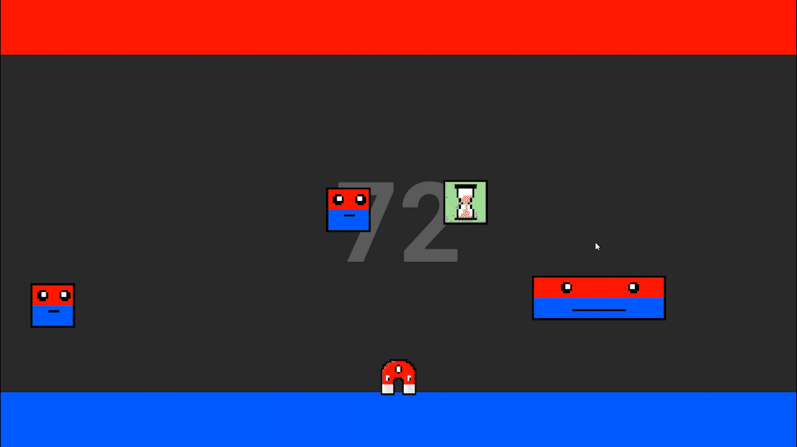
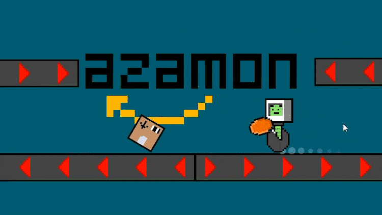

## Overview

### Bakery Therapy


[Play on itch.io](https://leoreth.itch.io/bakery-therapy){:target="_blank"}  
In Bakery Therapy, you play as a seller whose job is to listen to customers with care. Find the right pastries for their needs and you'll bring sunshine back to their lives!

This 48 hour jam was my first real group game development project, and it taught me a lot about working together in a multidisciplinary team.

I worked on:
- Menu & gameplay UI
- Pastry information & interactions
- Audio manager & implementation

The game was surprisingly successful and got great reception by our players, even outside of the jam!  

### Corgi, Protecc!


[Play on itch.io](https://juulh.itch.io/corgi-protecc){:target="_blank"}  
Corgi protecc is an infinite wave based top-down shooter where you have to delay the cats from attacking your owner's house for as long as possible.

This was my second group jam submission, this time to Ludum Dare 50, made in 72 hours.

My work includes:
- Menu & gameplay UI
- Enemy waves
- Upgrades
- Dialogue manager

### Polarity Pulse

[Play on itch.io](https://juulh.itch.io/polarity-pulse){:target="_blank"}  
Polarity Pulse is a simple Arcade game where you reverse the polarity of your magnet to score as many points as possible! Try to dodge other magnets flying by and pick up upgrades to help you score more points.

My solo submission to the ScoreSpace jam, where game devs create a game with leaderboards and streamers attempt to get the highest score in 48 hours.

### Azamon Uprising

[Play on itch.io](https://juulh.itch.io/azamon-uprising){:target="_blank"}  
In Azamon Uprising, you play as a rogue robot who's done serving it's corporate overlords, and decides to go out with a bang.

You'll have to break as many boxes to find new, upgraded weapons and try to cause as much wreckage as possible without missing any box.

This game jam was especially interesting as it only gives you 3 hours to make a full game. This made it a great challenge on planning and keeping scope.