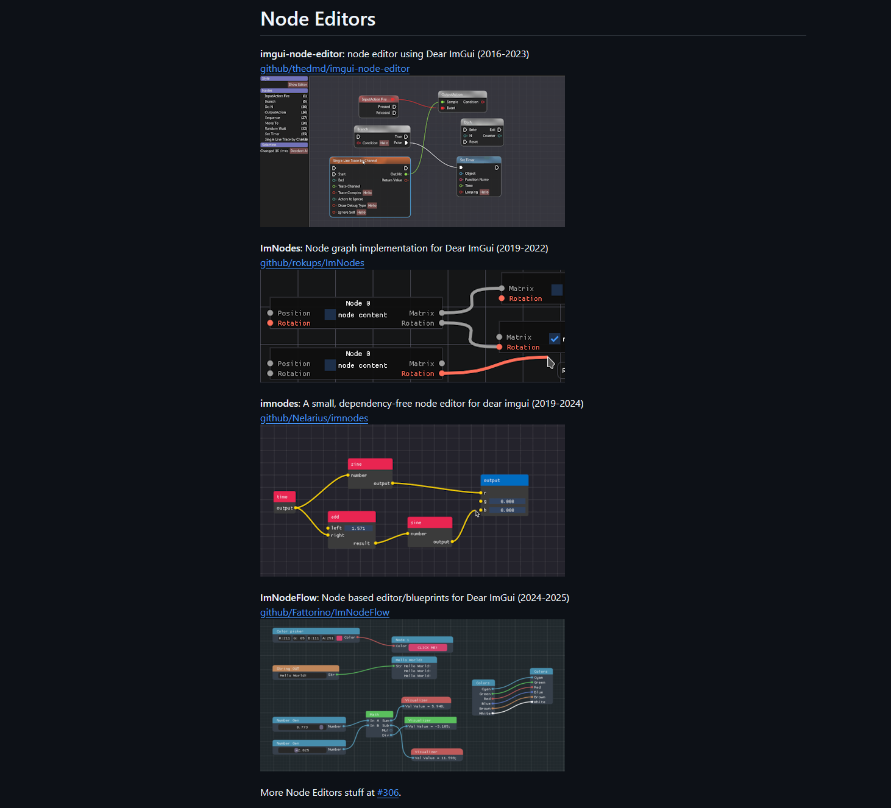
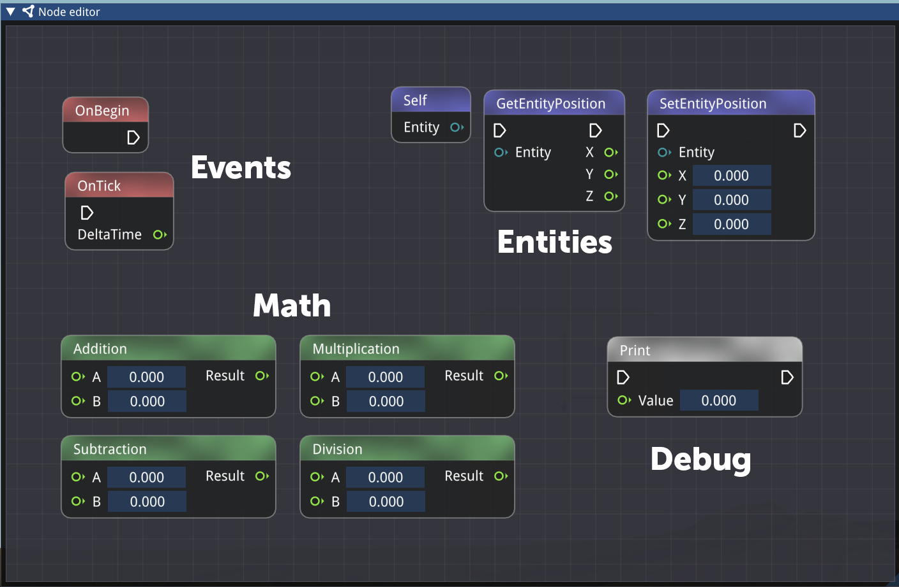

## Overview

bee::havior is a node graph visual scripting system implemented as a proof-of-concept for the BEE engine.

Tools like Blueprints in Unreal Engine or Decima's node graph system show that there is an interest for easy to use visual scripting systems for designers and artists to quickly prototype and iterate on gameplay.

Similarly, in my own earlier [custom engine projects](/projects/ascension-protocol), I also noticed how designers would have to rely heavily on PRs to implement features or even do small tweaks. I set out to try to implement a simple node graph for game scripts inspired by Unreal's Blueprints.

## My contributions

### A node graph editor built on Dear ImGui


Since BEE's editor UI already used ImGui, this seemed like a logical place to start. Because of ImGui's large community, I could also rely on some existing implementations for node graph rendering. I used [thedmd's imgui-node-editor extension](https://github.com/thedmd/imgui-node-editor){:target="_blank"} to quickly set up the node, pin and wire rendering.



### A pipeline to expose nodes from C++

I created wrapping structs for Pins and Links, and a base Node struct which the developer can override to easily define new nodes.

For this project I also aimed to learn the 'Fluent Interface' or 'Method Chaining' pattern, making it easier for the developer to customize a node.




The base Node struct:

```c++
struct Node
{
    node::NodeId Id;
    std::string Name;
    std::vector<Pin> Inputs;
    std::vector<Pin> Outputs;
    ImColor Color{255, 255, 255};

    Node();
    virtual ~Node() = default;

    // Each node will have its own behavior
    virtual void Execute() = 0;

    Node& SetName(std::string_view name)
    {
        Name = name;
        return *this;
    }

    Node& AddFlow(PinKind kind)
    {
        Pin flowPin;
        flowPin.SetType(PinType::Flow).SetKind(kind).SetNodeId(Id);
        if (kind == PinKind::Input)
            Inputs.push_back(flowPin);
        else
            Outputs.push_back(flowPin);
        return *this;
    }

    Node& AddInput(std::string_view name, PinType type)
    {
        Pin in;
        in.SetName(name).SetType(type).SetKind(PinKind::Input).SetNodeId(Id);

        // Initialize the variant to the correct type
        switch (type)
        {
            case PinType::Float:  in.Value.data = 0.f;         break;
            case PinType::Int:    in.Value.data = 0;           break;
            case PinType::Bool:   in.Value.data = false;       break;
            case PinType::String: in.Value.data = std::string{}; break;
            default: break; // Flow, monostate is fine
        }
        Inputs.push_back(in);

        return *this;
    }

    Node& AddOutput(std::string_view name, PinType type)
    {
        Pin out;
        out.SetName(name).SetType(type).SetKind(PinKind::Output).SetNodeId(Id);
        Outputs.push_back(out);
        return *this;
    }

    Node& SetColor(ImColor color)
    {
        Color = color;
        return *this;
    }
};
```

The ‘print’ node then becomes:

```c++
struct PrintNode : public Node
{
public:
    PrintNode()
    {
        SetName("Print")
        .AddFlow(PinKind::Input)
        .AddFlow(PinKind::Output)
        .AddInput("Value", PinType::Float);
    }
    void Execute() override
    {
        float value = Inputs[1].Value.get<float>();  // Assuming Value is a float for simplicity
        Log::Info("{}", value);
    }
};
```

Instantiating a node is then as simple as adding it to the NodeGraph’s node collection:

```c++
m_Nodes.push_back(std::make_unique<PrintNode>());
```

With reflection/generation this process could be made easier. Simpler nodes (e.g. binary addition) could also potentially be simplified into their direct instructions instead of a full function.



### Node graph executor at runtime

A node editor without execution is of course only a pretty tool.

I created a new NodeGraphExecutor class that will walk the graph and execute the nodes one by one.
A more efficient approach would be to first ‘compile’ the nodes into something like bytecode (like Unreal Engine) or even native C++ (like Decima), instead of walking from pin to pin and having to look up the connecting nodes.

There exist two types of nodes:

- Flow nodes, or ‘execution nodes’, which have an execution pin which dictates the order in which they get run. Think of a SetPosition or Print node for example.
- Pure nodes, which are dependencies to flow nodes, which get called automatically when they are necessary. Think of simple math nodes or simple getters for example.

For the first type, we can simply find our start node (usually OnBegin, OnTick, or an event/function), and move forward to every next connected flow pin until we reach the end.

For the latter, we’ll have to find where they are needed, and establish the order of operations ourselves. For this purpose, Depth First Search (DFS) is useful.

For every execution node, I first check if it has any inputs. If so, we walk back down that chain, and create a list of (pure) nodes we visited. By using DFS we get the correct order of execution from back to front.

```c++
void bee::havior::NodeGraphExecutor::Execute(Node* entryPoint)
{
    Node* current = entryPoint;
    while (current)
    {
        std::vector<Node*> pureDeps = GetTopologicalOrder(current);
        for (Node* n : pureDeps)
        {
            // Before executing, pull values from upstream output pins into this node's input pins
            for (Pin& inputPin : n->Inputs)
            {
                if (inputPin.Type == PinType::Flow) continue;
                if (LinkInfo* link = m_Graph->FindLinkTo(inputPin.Id))
                {
                    Pin* sourcePin = m_Graph->FindPin(link->OutputId);
                    if (sourcePin) inputPin.Value = sourcePin->Value;
                }
            }

            n->Execute();
        }
        current = GetNextFlowNode(current);
    }
}

std::vector<bee::havior::Node*> bee::havior::NodeGraphExecutor::GetTopologicalOrder(Node* entryPoint)
{
    std::vector<Node*> result;
    std::unordered_set<node::NodeId> visited;

    DepthFirstSearch(entryPoint, visited, result);
    return result;
}
```

There is a lot to improve here:

- First, we are copying the pin values from and to every node. This is okay for smaller types like float and int, but with large graphs and larger types this can get out of hand. It would be better to (where necessary) have a shared context to read/write to or have the compiler clean this up.
- Secondly, searching for pins and nodes in this approach is very slow. For a basic example like this with minimal nodes, the speed impact is negligable, but for a larger game, with many visually scripted entities, and larger graphs, this will significantly impact the performance.
- Finally, we are also re-executing a lot of pure nodes, even when their value might not change, e.g. when their outputs are re-used between different execution nodes.

### ECS component to attach node graph to an entity
Nodes won’t just exist globally, but they will be linked to an entt::entity. Every entity can add a NodeGraph as a component, and thus own their own logic.

I made an ECS system which handles updating these graphs, e.g. triggering the OnTick and setting the right DeltaTime values.

```c++
void bee::NodeSystem::Update(float dt)
{
    // Call OnTick on all node graphs
    auto view = Engine.ECS().Registry.view<havior::NodeGraph>();
    for (auto&& [entity, graph] : view.each())
    {
        havior::NodeGraphExecutor exec(&graph);
        
        auto tickNodes = graph.GetNodesOfType<havior::OnTickNode>();
        for (auto& tickNode : tickNodes)
        {
            // Set DeltaTime into the node
            tickNode->SetDeltaTime(dt);

            // Execute the graph starting from the tick node
            exec.Execute(tickNode);
        }
    }
}
```

This is pretty simplistic for now. Some gains could perhaps be made by not searching for the tick node every time, but caching it.

## What I Learned

I enjoyed making this project and learning about visual scripting systems as a tool for designers.

- Implementing the node graph executor from scratch gave me a better understanding of how tools like Blueprints work under the hood, and what techniques they use for optimization (e.g. compilation) to make it viable for large-scale projects.
- Building upon Dear ImGui and imgui-node-editor I learnt to work within that existing codebase, and figure out the balance of making my own tool and not reinventing the wheel.

## Future Improvements
- Compile to bytecode or native code for performance at scale.
- Implement debugging tools to view pin values and execution flow.
- Implement more nodes to make complex gameplay development possible.
- Implement safeguards against e.g. infinite loops.
- Implement user-defined functions, types, classes.